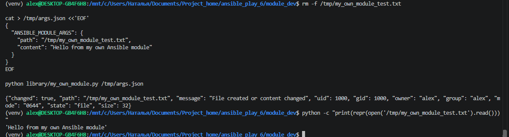
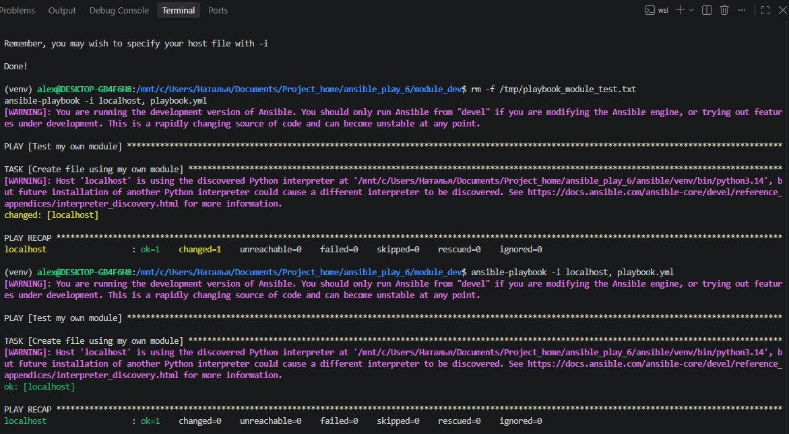
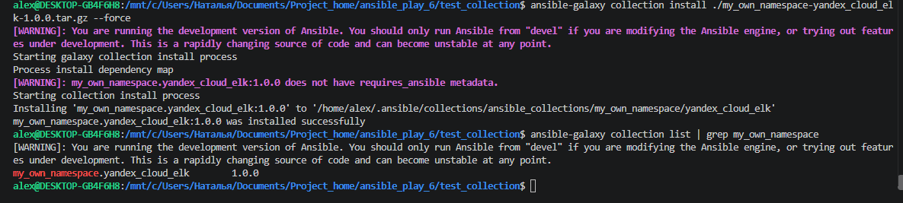
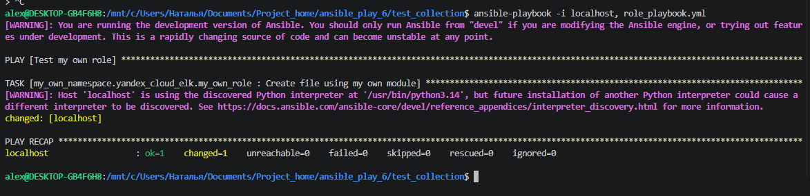

# Домашняя работа "Создание собственных модулей Ansible"

## Подготовка окружения

Что сделал:
- проверил Python;
- проверил Ansible;
- перешёл в WSL;
- подготовил рабочую директорию.

Команды:
```
python3 --version
ansible --version
git --version
```

Результат:
```
Python 3.14.4
Ansible Core 2.20.1
Git 2.53.0
```

Скачал исходный код Ansible:
```
git clone https://github.com/ansible/ansible.git
cd ansible
```

Создал отдельное виртуальное окружение Python:
```
python3 -m venv venv
```

Активировал его:
```
. venv/bin/activate
```

После активации, мы вошли в виртуальное пространство.
Для разработки Ansible модулей устанавливаем зависимости как в лекции:
```
python -m pip install -r requirements.txt
```

Все зависимости установились успешно.

Виртуальное окружение здесь нужно для того, чтобы зависимости, необходимые при разработке и тестировании модуля, были изолированы от системного Python и установленного в системе Ansible.

### 1. Создаем файл.
Тут всё просто. Создаем файл my_own_module.py
```
nano library/my_own_module.py
```
### 2. Наполним содержим.
Наполнили его содержимым из домашней работы.

### 3. Заполнить файл с требованиями Ansible.

Тут посложнее.
Модуль должен принимать два параметра:

path — путь, по которому необходимо создать текстовый файл;
content — содержимое создаваемого файла.

Как мы знаем из лекции, для передачи параметров используется AnsibleModule и argument_spec:
```
module_args = dict( 
    path=dict(type='str', required=True), 
    content=dict(type='str', required=True) 
    )
```
Модуль проверяет, существует ли указанный файл, и сравнивает его текущее содержимое с переданным параметром content.
Если файла нет или его содержимое отличается, модуль записывает новое содержимое и возвращает:
```
changed=true
```

Если файл существует и содержит нужный нам текст, тогда:
```
changed=false
```
Никакие изменения не применяются.

### 4. Проверка модуля.

Для локальной провекри модуля, создао JSON файл с параметрами:

```
{ 
    "ANSIBLE_MODULE_ARGS": { 
        "path": "/tmp/my_own_module_test.txt", 
        "content": "Hello from my own Ansible module"
         } 
}
```

Запустил модуль напрямую:
```
python library/my_own_module.py /tmp/args.json
```

При первом запуске модуль вернул:
```
changed=true
```
Это означает, что модуль внёс изменения и создал требуемый файл.

Проверил содержимое созданного файла:
```
cat /tmp/my_own_module_test.txt
```
Результат:
```
Hello from my own Ansible module
```
Таким образом, модуль корректно принимает параметры path и content и создаёт текстовый файл с заданным содержимым.

### 5. Пишем ansible playbook и запускаем наш module

Создал single task playbook playbook.yml который использует наш модуль:

```
---
- name: Test my own module
  hosts: localhost
  connection: local
  gather_facts: false

  tasks:
    - name: Create file using my own module
      my_own_module:
        path: /tmp/playbook_module_test.txt
        content: "File created from Ansible playbook"
```

Где my_own_module - наш модуль.
Модуль расположен в директории library рядом с playbook

Перед запуском проверил синтаксис playbook:
```
ansible-playbook playbook.yml --syntax-check
```
После этого запустил playbook:
```
ansible-playbook -i localhost, playbook.yml
```

Всё запустилось успешно!
```
PLAY RECAP 
localhost                  : ok=1    changed=1    unreachable=0    failed=0    skipped=0    rescued=0    ignored=0   
```

По сути, он запустил наш модуль, взял параметры path и content. После чего создал файл с указанным содержимым.

### 6. Проверка идемпотентности

Для проверки идемпотентности повторно запустил тот же playbook без изменения его параметров:
```
ansible-playbook -i localhost, playbook.yml
```
При повторном выполнении модуль проверяет существующий файл и сравнивает его содержимое с переданным параметром content.

Так как файл уже существует и содержит требуемый текст, повторная запись не выполняется и Ansible возвращает:
```
changed=0
```
Таким образом, модуль является идемпотентным: повторный запуск с теми же параметрами не изменяет состояние системы.

### 7. Выход из виртуального окружения

После завершения разработки и проверки собственного модуля вышел из виртуального окружения:
```
deactivate
```

### 8. Создание Ansible Collection

Инициализировал новую Ansible Collection командой:
```
ansible-galaxy collection init my_own_namespace.yandex_cloud_elk
```
В результате была создана стандартная структура Collection:

```
my_own_namespace/yandex_cloud_elk
my_own_namespace/yandex_cloud_elk/docs
my_own_namespace/yandex_cloud_elk/galaxy.yml
my_own_namespace/yandex_cloud_elk/meta
my_own_namespace/yandex_cloud_elk/meta/runtime.yml
my_own_namespace/yandex_cloud_elk/plugins
my_own_namespace/yandex_cloud_elk/plugins/README.md
my_own_namespace/yandex_cloud_elk/README.md
my_own_namespace/yandex_cloud_elk/roles
```

Collection позволяет хранить собственные Ansible-модули и роли в единой переиспользуемой структуре.

### 9. Добовляем модуль в колекцию

Создал в Collection директорию для собственных модулей:
```
mkdir -p my_own_namespace/yandex_cloud_elk/plugins/modules
```
Перенёс разработанный ранее модуль my_own_module.py в Collection:
```
cp module_dev/library/my_own_module.py \
my_own_namespace/yandex_cloud_elk/plugins/modules/
```

В результате модуль находится:
```
my_own_namespace/yandex_cloud_elk/plugins/modules/my_own_module.py
```

Структура теперь выглядит так:

```
my_own_namespace/yandex_cloud_elk/galaxy.yml
my_own_namespace/yandex_cloud_elk/meta/runtime.yml
my_own_namespace/yandex_cloud_elk/plugins/modules/my_own_module.py
my_own_namespace/yandex_cloud_elk/plugins/README.md
my_own_namespace/yandex_cloud_elk/README.md
```

Теперь my_own_module является частью созданной Collection.

### 10. Создание Role

Single task преобразуется в отдельную роль. Её как раз мы разместили в коллекции.

Роль создаём командой:

```
ansible-galaxy role init my_own_role \
--init-path my_own_namespace/yandex_cloud_elk/roles
```

Параметры собственного модуля вынес в defaults/main.yml.
В tasks/main.yml добавил одну задачу, которая вызывает созданный ранее модуль из Collection:
```
---
- name: Create file using my own module
  my_own_namespace.yandex_cloud_elk.my_own_module:
    path: "{{ my_own_module_path }}"
    content: "{{ my_own_module_content }}"
```

Таким образом, значения path и content больше не указаны жёстко внутри задачи, а задаются через переменные роли и при необходимости могут быть переопределены.

### 11. Создание playbook для Role

Создаем отдельный playbook из созданной нами роли:
```
---
- name: Test my own role
  hosts: localhost
  connection: local
  gather_facts: false

  roles:
    - role: my_own_namespace.yandex_cloud_elk.my_own_role
```

Теперь playbook не вызывает собственный модуль напрямую. Вместо этого он подключает роль, а уже роль вызывает my_own_module и передаёт ему параметры из defaults/main.yml.
Получается примерно так:

role_playbook.yml -> my_own_role -> tasks/main.yml -> my_own_module.py -> создание txt

Значения path и content хранятся в defaults/main.yml, поэтому их можно переопределить без изменения самой задачи роли.

### 12. Заполняем README.md на коллекцию и ставим ему тэг 1.0

Заполнил документацию Collection и файл galaxy.yml.

В galaxy.yml указал:
- namespace;
- имя Collection;
- версию 1.0.0;
- автора;
- описание;
- лицензию;
- ссылки на GitHub-репозиторий.

Также добавил описание собственного модуля и Role в README.md.

Collection разместил в Git-репозитории и отправил на GitHub.

На готовую версию Collection установил тег:

```
git tag 1.0.0
git push origin 1.0.0
```

### 13. Сборка Collections.

Из корневой директории Collection выполнил сборку:
```
ansible-galaxy collection build
```

В результате был создан архив:
```
my_own_namespace-yandex_cloud_elk-1.0.0.tar.gz
```

Архив содержит подготовленную Ansible Collection версии 1.0.0.

### 14. Подготовка отдельной директории для проверки

Создаём отдельную директорию test_collection и переносим в неё:

- playbook для использования Role;
- архив собранной Collection.

Новая директория будет использоваться локально, для устновки Collection из архива и дальнейшего запуска playbook.

### 15. Делаем установку из локального архиваю

Как по лекции, мы устанавливаем архив:
```
ansible-galaxy collection install ./my_own_namespace-yandex_cloud_elk-1.0.0.tar.gz
```
После установки проверил наличие Collection:
```
ansible-galaxy collection list
```
В выводе нам показывается:

```
[WARNING]: Collection at '/usr/lib/python3/dist-packages/ansible/_internal/ansible_collections/ansible/_protomatter' does not have a MANIFEST.json file, nor has it galaxy.yml: cannot detect version.
my_own_namespace.yandex_cloud_elk        1.0.0  

# /usr/lib/python3/dist-packages/ansible/_internal/ansible_collections
```

Collection my_own_namespace.yandex_cloud_elk версии 1.0.0 успешно установлена.

### 16. Проверка установленной Collection

После установки архива, запустили локально playbook:

```
ansible-playbook -i localhost, role_playbook.yml
```

При первом запуске playbook успешно нашёл Role из установленной Collection и выполнил собственный модуль:
```
localhost : ok=1    changed=1    unreachable=0    failed=0
```

В результате был создан файл /tmp/role_module_test.txt

В файле содержится информация: 'File created from Ansible role'
Запустили ещё раз эту команду:
```
ansible-playbook -i localhost, role_playbook.yml
```
Результат:
```
localhost : ok=1    changed=0    unreachable=0    failed=0
```

Таким образом, установленная Collection работает корректно, а собственный модуль сохраняет идемпотентность.

### 17. ИТОГ

Готовая коллекция в гитхаб репозитории:

https://github.com/Folau1/ansimble_play_6

Архив Collection:

https://github.com/Folau1/ansimble_play_6/blob/main/my_own_namespace-yandex_cloud_elk-1.0.0.tar.gz

Также прикладываю скриншоты под задания 4, 6, 15 и 16.

4 Задание:



6 Задание:



15 Задание:



16 Задание:


